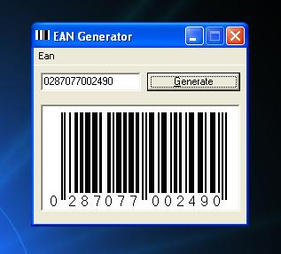

## Barcode Generator EAN8 & 13 \- UK Barcodes\!

### Description

This, my first piece of code, generates EAN 13 and EAN 8 barcodes. This is an update of code 31131. I made it more for functionality than learning. If there are any bugs or anything you would like to know, please comment. I appreciate your input.
 
### More Info
 

             |
---                |---
**Submitted On**   |2003-09-02 23:23:28
**By**             |[Max Dymond](https://github.com/Planet-Source-Code/PSCIndex/blob/master/ByAuthor/max-dymond.md)
**Level**          |Beginner
**User Rating**    |5.0 (25 globes from 5 users)
**Compatibility**  |VB 6\.0
**Category**       |[Graphics](https://github.com/Planet-Source-Code/PSCIndex/blob/master/ByCategory/graphics__1-46.md)
**World**          |[Visual Basic](https://github.com/Planet-Source-Code/PSCIndex/blob/master/ByWorld/visual-basic.md)
**Archive File**   |[Barcode\_Ge164202962003\.zip](https://github.com/Planet-Source-Code/max-dymond-barcode-generator-ean8-13-uk-barcodes__1-48309/archive/master.zip)

